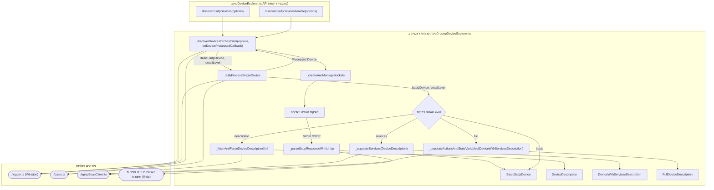

# תוכנית לשינוי מבנה (Refactoring) של מודול `upnpDeviceExplorer.ts`

## הנמקות והחלטות עיקריות (רקע מהדיון)

מסמך זה מתאר תוכנית לשינוי מבנה (refactoring) של המודול `upnpDeviceExplorer.ts`. ההחלטות המרכזיות וההנמקות מאחוריהן, כפי שעלו בדיון, הן:

1.  **פרסור HTTP**: הוחלט להחליף את המימוש הידני הקיים לפרסור הודעות SSDP בספרייה ייעודית. ההמלצה היא להשתמש ב-`llhttp`, שהיא היורשת המתוחזקת של `http-parser-js` ומבוססת על פרסר ה-HTTP של Node.js, מה שמבטיח יעילות וטיפול נכון במקרי קצה.
2.  **לוגינג**: הוחלט להסיר לחלוטין את האפשרות לספק `customLogger` חיצוני. המודול יסתמך אך ורק על הלוגר הפנימי שנוצר באמצעות `createModuleLogger('upnpDeviceExplorer')` מקובץ [`src/logger.ts`](src/logger.ts). לוגר זה מושפע ממשתני סביבה (`LOG_LEVEL`, `LOG_MODULES`) ומספק גמישות מספקת.
3.  **טיפול בהודעות `NOTIFY` ו-`M-SEARCH`**:
    *   הוחלט לאמץ גישה של שני סוקטים לכל משפחת IP (IPv4, ואופציונלית IPv6) כדי לטפל בהודעות SSDP:
        *   **Notify Socket**: יקשור לפורט `1900` ויצטרף לקבוצת המולטיקאסט המתאימה. הוא יהיה אחראי על קליטה פסיבית של הודעות `NOTIFY` (כגון `ssdp:alive`, `ssdp:byebye`) וייתכן שגם הודעות `M-SEARCH` ממקורות אחרים ברשת.
        *   **M-Search Socket**: יקשור לפורט אפימרלי (אקראי) ויצטרף גם הוא לקבוצת המולטיקאסט. הוא ישמש לשליחת בקשות `M-SEARCH` ולקבלת תגובות `HTTP/1.1 200 OK` ישירות אליו.
    *   גישה זו, כפי שנחקרה ונדונה (בהשראת [`drafts/enhanced_ssdp_discoverer.ts`](drafts/enhanced_ssdp_discoverer.ts) ו-[`documentation/ssdp_discovery_findings_report.md`](documentation/ssdp_discovery_findings_report.md)), מבטיחה טיפול אמין יותר בהודעות אסינכרוניות.
4.  **ממשקי רשת**: הוחלט להסיר את הלוגיקה המורכבת של זיהוי ובחירת ממשקי רשת ספציפיים. הסוקטים יקשרו ל-`0.0.0.0` (עבור IPv4) או ל-`::` (עבור IPv6, אם מופעל), מה שמאפשר האזנה בכל הממשקים הזמינים.
5.  **API לרמות פירוט**:
    *   ה-API החיצוני יכלול שתי פונקציות ייצוא עיקריות: `discoverSsdpDevices` (מחזירה Promise עם מערך) ו-`discoverSsdpDevicesIterable` (מחזירה AsyncIterable).
    *   שתי הפונקציות יקבלו אובייקט `DiscoveryOptions` שיכלול פרמטר `detailLevel: DiscoveryDetailLevel` (`'basic'`, `'description'`, `'services'`, `'full'`).
    *   השימוש ב-TypeScript overloads יבטיח שטיפוס ההחזרה של הפונקציות יהיה מדויק ותואם ל-`detailLevel` שצוין.
6.  **מודולריות פנימית של חקירה**: הלוגיקה הפנימית של חקירת התקן תחולק לפונקציות ייעודיות לכל שלב (אחזור תיאור XML, אכלוס שירותים, אכלוס אקשנים ומשתני מצב), כדי לשפר קריאות ותחזוקתיות. הפונקציה המרכזית הפנימית תהיה `_discoverDevicesOrchestrator` שתנהל את תהליך הגילוי ותקרא לפונקציה `_fullyProcessSingleDevice` עבור כל התקן. פונקציה זו, בתורה, תקרא לפונקציות חקירה ספציפיות יותר.
7.  **הסרת `upnpDiscoveryService.ts`**: הוחלט להסיר את הקובץ [`src/upnpDiscoveryService.ts`](src/upnpDiscoveryService.ts) ולמזג את הפונקציונליות הרלוונטית שלו (אם קיימת) לתוך `upnpDeviceExplorer.ts` או להעביר קבועים ל-[`src/types.ts`](src/types.ts), כדי לפשט את מבנה הפרויקט.
8.  **תלות ב-`upnpSoapClient.ts`**: חקירת השירותים והאקשנים תמשיך להסתמך על הפונקציונליות הקיימת ב-[`src/upnpSoapClient.ts`](src/upnpSoapClient.ts) לשליחת פקודות SOAP.
9.  **קולבק `onDeviceFound`**: הוחלט להוסיף חזרה את האפשרות לקולבק `onDeviceFound` ל-`DiscoveryOptions` עבור הפונקציה `discoverSsdpDevices` (הגרסה שמחזירה Promise למערך), לנוחות נוספת ולאפשרות לעיבוד מיידי של כל התקן שמתגלה ומעובד במלואו.

## מטרות עיקריות (לאחר הנמקות):

1.  **שיפור הטיפול ב-SSDP**: הפרדה לטיפול ב-`NOTIFY` ובתגובות `M-SEARCH` באמצעות שני סוקטים (עבור כל משפחת IP).
2.  **פישוט וייעול**:
    - החלפת פרסור HTTP ידני בספרייה ייעודית (מומלץ: `llhttp`).
    - הסרת לוגיקת ממשקי רשת מורכבת ושימוש ב-`0.0.0.0` (עבור IPv4) ו-`::` (עבור IPv6) לקשירת סוקטים.
    - איחוד כל הלוגיקה לשימוש בלוגר המרכזי של הפרויקט (`./logger.ts`).
3.  **גמישות ובקרת פירוט**:
    - מתן אפשרות למשתמש לבחור את רמת הפירוט של המידע שמתקבל על ההתקנים באמצעות פרמטר `detailLevel` שיועבר לפונקציות הייצוא הראשיות.
    - הפונקציות הראשיות (`discoverSsdpDevices` ו-`discoverSsdpDevicesIterable`) ישתמשו ב-TypeScript overloads (העמסת פונקציות) כדי להחזיר טיפוס החזרה מדויק בהתאם לערך של `detailLevel` שסופק באופציות. זה יבטיח בטיחות טיפוסים טובה יותר וחווית מפתח משופרת.
4.  **שמירה על תמיכה ב-IPv6**: לאפשר גילוי גם ברשתות IPv6, נשלט על ידי פרמטר `includeIPv6` (ברירת מחדל `false`). הגישה המומלצת היא שימוש בסוקטים נפרדים ל-IPv4 ול-IPv6.
5.  **מיזוג/הסרה של `upnpDiscoveryService.ts`**: פישוט מבנה הפרויקט על ידי הסרת שכבת השירות הזו והעברת פונקציונליות רלוונטית.

## תרשים רעיוני של המבנה החדש:



## API מוצע (עם הערות JSDoc לדוגמה)

```typescript
// In types.ts
export type DiscoveryDetailLevel =
  | "basic"
  | "description"
  | "services"
  | "full";

// טיפוס מאוחד לכל רמות הפירוט האפשריות של התקן
export type ProcessedDevice = 
  | BasicSsdpDevice 
  | DeviceDescription 
  | DeviceWithServicesDescription 
  | FullDeviceDescription;

export interface DiscoveryOptions {
  timeoutMs?: number; // Default: 5000
  searchTarget?: string; // Default: "ssdp:all"
  // discoveryTimeoutPerInterfaceMs הוסר, timeoutMs ישלוט על משך הגילוי הכולל
  includeIPv6?: boolean; // Default: false
  detailLevel?: DiscoveryDetailLevel; // Default: 'full'
  onDeviceFound?: (device: ProcessedDevice) => void; // קולבק אופציונלי עבור discoverSsdpDevices
  // ניתן להוסיף פרמטרים נוספים לפי הצורך, למשל User-Agent
}

// In upnpDeviceExplorer.ts

/**
 * @hebrew מגלה התקני UPnP ברשת.
 * רמת הפירוט של המידע המוחזר נקבעת על ידי `options.detailLevel`.
 * אם מסופק קולבק `onDeviceFound`, הוא יופעל עבור כל התקן שמתגלה ומעובד.
 * הפונקציה מחזירה Promise שמתממש עם מערך של כל ההתקנים שנמצאו ועובדו.
 *
 * @param options - אופציות לגילוי.
 * @returns הבטחה שתתממש עם מערך של התקנים. טיפוס ההתקנים במערך תלוי ב-`detailLevel`.
 */
export declare function discoverSsdpDevices(
  options: DiscoveryOptions & { detailLevel: "basic" }
): Promise<BasicSsdpDevice[]>;
export declare function discoverSsdpDevices(
  options: DiscoveryOptions & { detailLevel: "description" }
): Promise<DeviceDescription[]>;
export declare function discoverSsdpDevices(
  options: DiscoveryOptions & { detailLevel: "services" }
): Promise<DeviceWithServicesDescription[]>;
export declare function discoverSsdpDevices(
  options: DiscoveryOptions & { detailLevel: "full" }
): Promise<FullDeviceDescription[]>;
export declare function discoverSsdpDevices(
  options?: DiscoveryOptions // detailLevel defaults to 'full'
): Promise<FullDeviceDescription[]>; 

/**
 * @hebrew מגלה התקני UPnP ברשת ומחזיר AsyncIterable של התקנים שנמצאו.
 * רמת הפירוט של המידע המוחזר עבור כל התקן נקבעת על ידי `options.detailLevel`.
 *
 * @param options - אופציות לגילוי.
 * @returns AsyncIterable המניב התקנים. טיפוס ההתקנים המנובים תלוי ב-`detailLevel`.
 */
export declare function discoverSsdpDevicesIterable(
  options: DiscoveryOptions & { detailLevel: "basic" }
): AsyncIterable<BasicSsdpDevice>;
export declare function discoverSsdpDevicesIterable(
  options: DiscoveryOptions & { detailLevel: "description" }
): AsyncIterable<DeviceDescription>;
export declare function discoverSsdpDevicesIterable(
  options: DiscoveryOptions & { detailLevel: "services" }
): AsyncIterable<DeviceWithServicesDescription>;
export declare function discoverSsdpDevicesIterable(
  options: DiscoveryOptions & { detailLevel: "full" }
): AsyncIterable<FullDeviceDescription>;
export declare function discoverSsdpDevicesIterable(
  options?: DiscoveryOptions // detailLevel defaults to 'full'
): AsyncIterable<FullDeviceDescription>;
```

## מבנה פונקציות פנימיות עיקריות (דוגמאות)


```typescript

/**
 * @hebrew (פנימי) יוצר ומנהל את סוקטי ה-UDP לגילוי SSDP.
 * מטפל ביצירת סוקטים ל-IPv4, ואם נדרש, גם ל-IPv6.
 * כל סוג IP יקבל סוקט נפרד להאזנה ל-NOTIFY וסוקט נפרד לשליחת M-SEARCH וקבלת תגובות.
 * עשוי להשתמש בפונקציית עזר פנימית `_createSingleSocket` למניעת חזרתיות.
 *
 * @param options - אופציות הגילוי, בעיקר `includeIPv6`.
 * @param onMessage - קולבק שיופעל עם קבלת הודעה (Buffer) ומידע על מקור ההודעה (rinfo) וסוג הסוקט.
 * @param onError - קולבק שיופעל במקרה של שגיאת סוקט.
 * @returns אובייקט עם מתודות לשליחת M-SEARCH (sendMSearch) וסגירת כל הסוקטים (closeAll).
 */
async function _createAndManageSockets(
  options: Pick<DiscoveryOptions, "includeIPv6">,
  onMessage: (
    msg: Buffer,
    rinfo: dgram.RemoteInfo,
    sourceSocketType: "notifyIPv4" | "msearchIPv4" | "notifyIPv6" | "msearchIPv6"
  ) => void,
  onError: (err: Error, sourceSocketType: string) => void
): Promise<{
  sendMSearch: (target: string, ipVersion: 4 | 6) => void;
  closeAll: () => Promise<void[]>;
}> {
  /* ... מימוש ... */
  /**
   * @hebrew (פנימי-פנימי) פונקציית עזר ליצירה והגדרת סוקט UDP בודד.
   */
  async function _createSingleSocket(/*...params...*/) { /* ... */ }
}

/**
 * @hebrew (פנימי) מנתח הודעת SSDP גולמית (Buffer) ומחזיר אובייקט עם כותרות מפורסרות.
 * ישתמש בספריית llhttp לפרסור יעיל.
 *
 * @param messageBuffer - ה-Buffer של ההודעה שהתקבלה.
 * @param rinfo - פרטי השולח (RemoteInfo) מהסוקט.
 * @returns אובייקט BasicSsdpDevice אם הפירסור הצליח וההודעה תקינה, אחרת null.
 */
function _parseSsdpResponseWithLlhttp(
  messageBuffer: Buffer,
  rinfo: dgram.RemoteInfo
): BasicSsdpDevice | null {
  /* ... מימוש ... */
}

/**
 * @hebrew (פנימי) פונקציית התזמור המרכזית. אחראית על הקמת הרשת,
 * האזנה להודעות SSDP, וקריאה לעיבוד מעמיק יותר של כל התקן שמתגלה.
 *
 * @param options - אופציות הגילוי המלאות.
 * @param onDeviceProcessed - קולבק שיופעל עבור כל התקן לאחר שעבר עיבוד מלא
 *                            בהתאם ל-`options.detailLevel`.
 */
async function _discoverDevicesOrchestrator(
  options: Required<DiscoveryOptions>, // Required כדי להבטיח ש-detailLevel קיים
  onDeviceProcessed: (device: ProcessedDevice) => void
): Promise<void> { // הפונקציה עצמה לא מחזירה את ההתקנים ישירות, אלא דרך הקולבק.
  // 1. אתחול: קריאה ל-_createAndManageSockets, הגדרת uniqueUsns Set.
  //    const socketManager = await _createAndManageSockets(...);
  // 2. שליחת M-SEARCH ראשונית דרך socketManager.sendMSearch.
  // 3. לולאת האזנה להודעות מהסוקטים (נשלטת על ידי options.timeoutMs):
  //    - עם קבלת הודעה (דרך הקולבק onMessage של _createAndManageSockets):
  //        - const basicDevice = _parseSsdpResponseWithLlhttp(msg, rinfo);
  //        - אם basicDevice תקין ואינו USN שכבר נצפה:
  //            - הוסף USN ל-uniqueUsns.
  _fullyProcessSingleDevice(basicDevice, options.detailLevel)
    .then(processedDevice => {
      if (processedDevice) {
        onDeviceProcessed(processedDevice);
      }
    })
    .catch(error => {
      logger.error(`Error processing device ${basicDevice.usn}:`, error);
      // אפשר להחליט אם להפעיל את הקולבק עם basicDevice או לא במקרה של שגיאה
    });
  // 4. המתנה לסיום ה-timeout או התערבות חיצונית.
  // 5. סגירת סוקטים בסיום: await socketManager.closeAll();
}

/**
 * @hebrew (פנימי) מקבל BasicSsdpDevice ומבצע חקירה מעמיקה יותר
 * בהתאם לרמת הפירוט המבוקשת.
 *
 * @param basicDevice - ההתקן הבסיסי שנתגלה.
 * @param detailLevel - רמת הפירוט הרצויה לחקירה.
 * @returns Promise ל-ProcessedDevice ברמת הפירוט המבוקשת, או null אם שלב קריטי נכשל.
 */
async function _fullyProcessSingleDevice(
  basicDevice: BasicSsdpDevice,
  detailLevel: DiscoveryDetailLevel
): Promise<ProcessedDevice | null> {
  let processedDevice: any = basicDevice;

  if (detailLevel === 'basic') {
    return basicDevice;
  }

  // שלב 2: אחזור וניתוח תיאור XML
  try {
    const deviceDescription = await _fetchAndParseDeviceDescriptionXml(basicDevice);
    if (!deviceDescription) {
      logger.warn(`Failed to fetch/parse device description for ${basicDevice.location}, returning basic info.`);
      return basicDevice; // או null אם מעדיפים לא להחזיר כלום במקרה כזה
    }
    processedDevice = deviceDescription;
  } catch (error) {
    logger.error(`Error fetching device description for ${basicDevice.location}: ${error.message}, returning basic info.`);
    return basicDevice; // או null
  }

  if (detailLevel === 'description') {
    return processedDevice as DeviceDescription;
  }

  // שלב 3: אכלוס שירותים
  try {
    const deviceWithServices = await _populateServices(processedDevice as DeviceDescription);
    if (!deviceWithServices) {
      logger.warn(`Failed to populate services for ${basicDevice.location}, returning device description.`);
      return processedDevice as DeviceDescription; // או null
    }
    processedDevice = deviceWithServices;
  } catch (error) {
    logger.error(`Error populating services for ${basicDevice.location}: ${error.message}, returning device description.`);
    return processedDevice as DeviceDescription; // או null
  }

  if (detailLevel === 'services') {
    return processedDevice as DeviceWithServicesDescription;
  }

  // שלב 4: אכלוס אקשנים ומשתני מצב
  // (detailLevel === 'full')
  try {
    const fullDevice = await _populateActionsAndStateVariables(processedDevice as DeviceWithServicesDescription);
    // _populateActionsAndStateVariables אמור להחזיר את האובייקט המועשר או לזרוק שגיאה
    processedDevice = fullDevice;
  } catch (error) {
    logger.error(`Error populating actions/state variables for ${basicDevice.location}: ${error.message}, returning device with services.`);
    return processedDevice as DeviceWithServicesDescription; // או null
  }

  return processedDevice as FullDeviceDescription;
}

/**
 * @hebrew (פנימי) אחראי על אחזור וניתוח קובץ התיאור (XML) של ההתקן מ-location URL.
 * אינו חוקר את שירותי ה-SCPD.
 * עשוי להשתמש בפונקציות עזר למיפוי חלקים ספציפיים של ה-XML (למשל, `_mapXmlToIconList`).
 * @param basicDevice - ההתקן הבסיסי שנתגלה (מכיל את ה-location URL).
 * @returns הבטחה ל-DeviceDescription (המכיל רשימת שירותים בסיסית, ללא פרטי SCPD),
 *          או null אם האחזור או הפירסור נכשלו.
 */
async function _fetchAndParseDeviceDescriptionXml(basicDevice: BasicSsdpDevice): Promise<DeviceDescription | null> {
  /* ... מימוש ... */
  // 1. אחזור ה-XML מה-basicDevice.location באמצעות axios/fetch.
  // 2. פירסור ה-XML באמצעות xml2js.
  // 3. מיפוי מבנה ה-XML המפורסר לאובייקט DeviceDescription.
  //    - כולל: UDN, friendlyName, manufacturer, modelName, iconList (אולי עם `_mapXmlToIconList`), וכו'.
  //    - כולל: serviceList עם המידע הבסיסי על כל שירות (serviceType, serviceId, SCPDURL, controlURL, eventSubURL).
  //    - לא כולל: חקירה של SCPDURL של כל שירות.
  // הפונקציה הקיימת `fetchDeviceDescription` ו-`mapXmlNodeToDeviceDescription` יפוצלו/יותאמו לכאן.
  /**
   * @hebrew (פנימי-פנימי, אופציונלי) ממפה קלט XML של אייקונים למערך DeviceIcon.
   * נדרש רק אם המיפוי מ-xml2js אינו ישיר.
   */
  function _mapXmlToIconList(iconNodes: any[]): DeviceIcon[] { /* ... */ }
}

/**
 * @hebrew (פנימי) מקבל DeviceDescription שכבר כולל את רשימת השירותים הבסיסית,
 * ואחראי על אחזור וניתוח קובץ ה-SCPD עבור כל שירות, כדי לאכלס את רשימת האקשנים ומשתני המצב הבסיסיים.
 * אינו יוצר את פונקציות ה-invoke/query המלאות בשלב זה.
 * עשוי להשתמש בפונקציות עזר למיפוי `actionList` ו-`stateVariableList` מה-SCPD.
 * @param deviceDescription - אובייקט DeviceDescription עם רשימת שירותים ראשונית.
 * @returns הבטחה ל-DeviceWithServicesDescription (טיפוס המכיל DeviceDescription + מידע SCPD בסיסי לשירותים),
 *          או null אם החקירה נכשלה עבור כל השירותים.
 */
async function _populateServices(deviceDescription: DeviceDescription): Promise<DeviceWithServicesDescription | null> {
  /* ... מימוש ... */
  let servicesPopulated = false;
  for (const service of deviceDescription.serviceList) {
    try {
      //     // 1. אחזור ה-XML של ה-SCPD מה-service.SCPDURL.
      //     // 2. פירסור ה-XML של ה-SCPD.
      //     // 3. מיפוי ל-service.actionList (עם `_mapXmlToActionList`).
      //     // 4. מיפוי ל-service.stateVariables (עם `_mapXmlToStateVariableList`).
      //     //    לא יוצרים כאן את פונקציות ה-invoke/query.
      //     // servicesPopulated = true;
    } catch (error) { /* ... */ }
  }
  return servicesPopulated ? (deviceDescription as DeviceWithServicesDescription) : null;
  // הפונקציה הקיימת `fetchServiceScpdDetails` תפוצל/תותאם לכאן.
  /**
   * @hebrew (פנימי-פנימי) ממפה קלט XML של רשימת אקשנים מ-SCPD למערך Action[].
   */
  function _mapXmlToActionList(actionNodes: any[]): Action[] { /* ... */ }
  /**
   * @hebrew (פנימי-פנימי) ממפה קלט XML של רשימת משתני מצב מ-SCPD למערך StateVariable[].
   */
  function _mapXmlToStateVariableList(stateVarNodes: any[]): StateVariable[] { /* ... */ }
}

/**
 * @hebrew (פנימי) מקבל DeviceWithServicesDescription שכבר כולל את פרטי ה-SCPD הבסיסיים של השירותים,
 * ואחראי על יצירת פונקציות ה-invoke (עבור אקשנים) ופונקציות ה-query (עבור משתני מצב) הדינמיות.
 * עשוי להשתמש בפונקציות עזר `_createInvokeFunctionForAction` ו-`_createQueryFunctionForStateVar`.
 * @param deviceWithServices - אובייקט DeviceWithServicesDescription.
 * @returns הבטחה ל-FullDeviceDescription עם פונקציות invoke/query פעילות.
 */
async function _populateActionsAndStateVariables(deviceWithServices: DeviceWithServicesDescription): Promise<FullDeviceDescription> {
  /* ... מימוש ... */
  for (const service of deviceWithServices.serviceList) { /* ... */ }
  return deviceWithServices as FullDeviceDescription;
  /**
   * @hebrew (פנימי-פנימי) יוצר פונקציית invoke דינמית עבור אקשן נתון.
   */
  function _createInvokeFunctionForAction(service: ServiceDescription, action: Action): (args: Record<string, any>) => Promise<Record<string, any>> { /* ... */ }
  /**
   * @hebrew (פנימי-פנימי, אופציונלי) יוצר פונקציית query דינמית עבור משתנה מצב נתון.
   */
  function _createQueryFunctionForStateVar(service: ServiceDescription, stateVar: StateVariable): () => Promise<any> { /* ... */ }
}

// הפונקציה `fetchDeviceDescription` הקיימת תצטרך לעבור שינוי משמעותי או להתפרק לפונקציות הנ"ל.
// הפונקציה `mapXmlNodeToDeviceDescription` הקיימת תתחלק גם היא בין הפונקציות הנ"ל.
// הפונקציה `fetchServiceScpdDetails` הקיימת תתחלק גם היא.

```

## שלבים מפורטים:

### שלב 1: הכנות ובסיס

1.  **התקנת ספריית פרסור HTTP**:
    - התקנת `llhttp` באמצעות מנהל החבילות (`npm install llhttp` או `bun install llhttp`).
2.  **עדכון `DiscoveryOptions` וטיפוסים קשורים ב-`types.ts`**:
    - לוודא שהפרמטר `includeIPv6: boolean` קיים (ברירת מחדל `false`).
    - הוספת `enum` או `type` עבור `DiscoveryDetailLevel` עם הערכים: `'basic'`, `'description'`, `'services'`, `'full'`.
    - הוספת שדה `detailLevel: DiscoveryDetailLevel` (אופציונלי, עם ערך ברירת מחדל `'full'`) לממשק `DiscoveryOptions`.
    - הוספת שדה `onDeviceFound?: (device: ProcessedDevice) => void` (אופציונלי) לממשק `DiscoveryOptions`.
3.  **הגדרת טיפוסי החזרה חדשים/מעודכנים ב-`types.ts` (לפי הצורך)**:
    - `BasicSsdpDevice` (קיים).
    - `DeviceDescription` (קיים, ייתכן שיש להתאים כך ששדות הקשורים לשירותים מלאים יהיו אופציונליים).
    - `DeviceWithServicesDescription` (שם לדוגמה, טיפוס חדש אם `DeviceDescription` לא יספיק לייצג התקן עם רשימת שירותים אך ללא פרטי SCPD מלאים של כל שירות. לחלופין, `ServiceDescription` יכול להכיל שדות אופציונליים עבור `actionList` ו-`stateVariables`).
    - `FullDeviceDescription` (קיים, הטיפוס המלא).
    - `ProcessedDevice` (טיפוס איחוד של כל טיפוסי ההחזרה האפשריים).

### שלב 2: שינויים עיקריים ב-`upnpDeviceExplorer.ts`

1.  **הסרת לוגיקת ממשקי רשת מורכבת**:
    - הסרת הפונקציה `findRelevantNetworkInterfaces`.
    - הסרת הפונקציה `discoverOnSingleInterface`.
2.  **יישום סוקטים (IPv4, ואופציונלית IPv6)**:
    - פיתוח פונקציית ליבה פנימית `_createAndManageSockets`.
3.  **החלפת פרסור HTTP**:
    - פיתוח פונקציה פנימית `_parseSsdpResponseWithLlhttp`.
4.  **איחוד לוגר**:
    - הסרת `defaultLogger` ושימוש בלוגר הגלובלי.
5.  **פונקציות ליבה פנימיות לגילוי וחקירה**:
    - פיתוח `_discoverDevicesOrchestrator`.
    - פיתוח `_fullyProcessSingleDevice`.
    - פיתוח/התאמה של `_fetchAndParseDeviceDescriptionXml`, `_populateServices`, ו-`_populateActionsAndStateVariables`.
6.  **פונקציות ייצוא ציבוריות (כולל גרסאות Iterable וטיפול בקולבק `onDeviceFound`)**:
    - מימוש `discoverSsdpDevices` עם overloads וטיפול בקולבק.
    - מימוש `discoverSsdpDevicesIterable` עם overloads.
7.  **פיצול והתאמה של פונקציות חקירה קיימות** (`fetchDeviceDescription`, `mapXmlNodeToDeviceDescription`, `fetchServiceScpdDetails`) לתוך הפונקציות הפנימיות החדשות.

### שלב 3: טיפול ב-`upnpDiscoveryService.ts`

- הסרת הקובץ [`src/upnpDiscoveryService.ts`](src/upnpDiscoveryService.ts).
- העברת קבועים רלוונטיים ל- [`src/types.ts`](src/types.ts) או ל-`upnpDeviceExplorer.ts`.
- עדכון קוד צרכן כדי להשתמש בפונקציות החדשות מ-`upnpDeviceExplorer.ts`.

### שלב 4: בדיקות וניקיון

1.  **בדיקות מקיפות**:
    - תקינות גילוי בסיסי (IPv4/IPv6).
    - קליטת הודעות `NOTIFY`.
    - תפקוד כל פונקציית ייצוא חדשה עם כל `detailLevel` ועם/בלי `onDeviceFound`.
    - טיפול ב-timeouts.
    - לוגינג.
2.  **ניקיון קוד**: הסרת קוד מת, הערות לא רלוונטיות.
3.  **עדכון תיעוד (JSDoc)**: עבור הפונקציות המיוצאות והטיפוסים.
