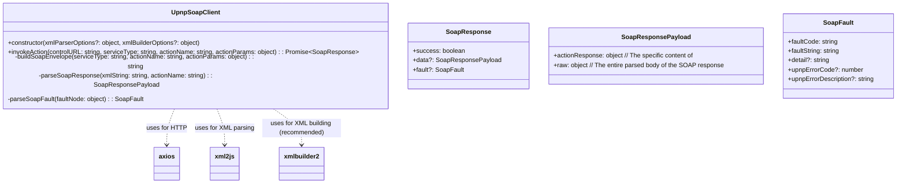

# תכנון מודול ContentDirectory ולקוח SOAP עבור ספריית DLNA/UPnP

מסמך זה מתאר את התכנון עבור החלקים בספריית לקוח DLNA (ב-TypeScript) האחראים על אינטראקציה עם שירות `ContentDirectory` של UPnP, וכן תכנון עבור מודול לקוח SOAP גנרי שישמש לתקשורת זו. התכנון לוקח בחשבון פונקציונליות קיימת בפרויקט לגילוי התקנים וניתוח תיאורי שירות (SCPD), הנמצאת במודולים כמו [`src/upnpDeviceExplorer.ts`](src/upnpDeviceExplorer.ts:1).

## 1. מודול לקוח SOAP גנרי: `UpnpSoapClient`

לפני שנצלול לפרטי `ContentDirectory`, נתכנן מודול רב-פעמי לטיפול בתקשורת SOAP עם שירותי UPnP.

**שם המודול/קלאס:** `UpnpSoapClient` (יישמר בקובץ נפרד, למשל `src/upnpSoapClient.ts`)

**אחריות:**
*   אבסטרקציה של תהליך בניית בקשות SOAP.
*   שליחת בקשות SOAP לשירותי UPnP.
*   ניתוח תגובות SOAP (הצלחה או שגיאה).
*   חשוב לציין: `UpnpSoapClient` *אינו* אחראי על גילוי שירותים, אחזור או ניתוח של תיאורי שירות (SCPD). הוא מקבל את המידע הדרוש (כמו `controlURL`, `serviceType`, `actionName`, ופרמטרים לפעולה) מהקוד המשתמש בו, אשר אמור להסתמך על מודולים אחרים (כמו [`src/upnpDeviceExplorer.ts`](src/upnpDeviceExplorer.ts:1)) לקבלת מידע זה.

**תרשים (Mermaid - Class Diagram):**


**API עיקרי:**
*   `async invokeAction(controlURL: string, serviceType: string, actionName: string, actionParams: object): Promise<SoapResponse>`
    *   `controlURL`: כתובת ה-URL של נקודת הבקרה של השירות. פרמטר זה יגיע בדרך כלל מאובייקט `ServiceDescription` המתקבל מהפונקציונליות הקיימת של גילוי התקנים (למשל, מ-[`fetchDeviceDescription()`](src/upnpDeviceExplorer.ts:502) דרך [`src/upnpDiscoveryService.ts`](src/upnpDiscoveryService.ts:1)).
    *   `serviceType`: ה-URN של סוג השירות (למשל, `urn:schemas-upnp-org:service:ContentDirectory:1`). גם פרמטר זה יגיע מאובייקט `ServiceDescription`.
    *   `actionName`: שם הפעולה לביצוע (למשל, `Browse`, `Search`).
    *   `actionParams`: אובייקט JavaScript המכיל את הארגומנטים של הפעולה. המפתחות באובייקט יהיו שמות הארגומנטים, והערכים יהיו ערכיהם. אובייקט זה צריך להיות בנוי בהתאם למידע המפורט ב-SCPD של השירות (שמנותח על ידי [`fetchServiceScpdDetails()`](src/upnpDeviceExplorer.ts:411) ב-[`src/upnpDeviceExplorer.ts`](src/upnpDeviceExplorer.ts:1)). `UpnpSoapClient` עצמו לא יבצע ולידציה של הפרמטרים מול ה-SCPD, אלא יבנה את הבקשה לפי מה שקיבל.
    *   מחזיר `Promise` עם אובייקט `SoapResponse`.

**פונקציות פנימיות עיקריות:**
*   `private buildSoapEnvelope(serviceType: string, actionName: string, actionParams: object): string`
    *   אחראית על בניית מחרוזת ה-XML המלאה של בקשת ה-SOAP.
    *   תשתמש בספרייה כמו `xmlbuilder2` ליצירת ה-XML.
    *   תבנה את מעטפת ה-SOAP (`<s:Envelope>`, `<s:Body>`).
    *   בתוך גוף הבקשה, תיצור אלמנט עבור הפעולה (`<u:actionName xmlns:u="serviceType">`) ותוסיף את הארגומנטים כאלמנטים מקוננים.
    *   **טיפול בארגומנטים:**
        *   ערכים פשוטים (מחרוזות, מספרים) יומרו ישירות לאלמנטי טקסט.
        *   יש לשקול תמיכה בתכונות XML (attributes) אם נדרש על ידי פרמטרים מסוימים (נדיר יותר ב-UPnP action arguments אך אפשרי).
*   `private async parseSoapResponse(xmlString: string, actionName: string): Promise<SoapResponsePayload>`
    *   תשתמש ב-`xml2js` (עם אופציות מתאימות, למשל `explicitArray: false`, `explicitCharkey: '_', mergeAttrs: true, explicitRoot: false`) לניתוח מחרוזת ה-XML של התגובה.
    *   תחלץ את התוכן מתוך `<s:Body>` ואז מתוך `<u:actionNameResponse>`.
    *   תחזיר אובייקט המכיל את התגובה המנותחת.
*   `private parseSoapFault(faultNode: object): SoapFault`
    *   תנתח את תוכן האלמנט `<s:Fault>`.
    *   תחלץ `faultcode`, `faultstring`, ופרטים נוספים מהאלמנט `<detail>`, כולל `UPnPError` אם קיים.

**תלויות (Dependencies):**
*   `axios`: לביצוע בקשות HTTP.
*   `xml2js`: לניתוח XML.
*   `xmlbuilder2` (מומלץ): לבניית XML בצורה בטוחה ונוחה. (יש להתקין: `npm install xmlbuilder2` או `bun install xmlbuilder2`).

**טיפול בשגיאות:**
*   `invokeAction` תטפל בשגיאות רשת (מ-`axios`) ובשגיאות SOAP.
*   במקרה של שגיאת SOAP, אובייקט `SoapFault` יוחזר בתוך `SoapResponse`.
*   במקרה של שגיאת רשת או ניתוח, תיזרק שגיאה מתאימה.

## 2. מודול `ContentDirectoryService`

מודול זה יהיה אחראי על האינטראקציה הספציפית עם שירות `ContentDirectory`.

**שם המודול/קלאס:** `ContentDirectoryService` (יישמר בקובץ נפרד, למשל `src/contentDirectoryService.ts`)

**אחריות:**
*   לספק ממשק נוח לשימוש בפעולות `Browse` ו-`Search` של שירות `ContentDirectory`.
*   להשתמש במידע מנותח מ-SCPD (שסופק על ידי [`src/upnpDeviceExplorer.ts`](src/upnpDeviceExplorer.ts:1)) כדי להבין את הפעולות הזמינות והארגומנטים שלהן.
*   לתרגם את הפרמטרים המתקבלים לפורמט הנדרש על ידי בקשות ה-SOAP, בהתאם למידע מה-SCPD.
*   לנתח את תגובות ה-DIDL-Lite המתקבלות ולהמירן למבני נתונים מוגדרים ב-TypeScript.

**תרשים (Mermaid - Class Diagram):**
```mermaid
classDiagram
    direction LR // Added for better layout with new classes

    class UpnpDeviceExplorer {
        +fetchDeviceDescription(basicDevice, includeScpdDetails): Promise~DeviceDescription~
        +fetchServiceScpdDetails(scpdUrl, baseUrl): Promise~ScpdResult~
    }

    class DeviceDescription {
        +UDN: string
        +friendlyName: string
        +deviceType: string
        +serviceList: ServiceDescription[]
        +getService(serviceTypeOrId: string): ServiceDescription | undefined
        +getScpdForService(service: ServiceDescription, explorer: UpnpDeviceExplorer): Promise~ScpdData~ // Example method
    }

    class ServiceDescription {
        +serviceType: string
        +serviceId: string
        +SCPDURL: string
        +controlURL: string
        +eventSubURL: string
        +parsedScpd?: ScpdData // Holds data from fetchServiceScpdDetails
    }

    class ScpdData {
         +actionList: Action[]
         +serviceStateTable: StateVariable[] // Renamed from stateVariables for clarity
    }

    class Action {
        +name: string
        +arguments: ActionArgument[]
    }

    class ActionArgument {
        +name: string
        +direction: "in" | "out"
        +relatedStateVariable: string
    }

    UpnpDeviceExplorer --|> DeviceDescription : creates
    DeviceDescription "1" -- "0..*" ServiceDescription : contains
    ServiceDescription "1" -- "0..1" ScpdData : can hold parsed

    ContentDirectoryService "1" -- "1" ServiceDescription : uses details from
    ContentDirectoryService "1" -- "1" UpnpSoapClient : uses for SOAP

    UpnpSoapClient ..> axios : uses
    UpnpSoapClient ..> xml2js : uses
    UpnpSoapClient ..> xmlbuilder2 : uses

    class UpnpSoapClient {
      +invokeAction(controlURL: string, serviceType: string, actionName: string, actionParams: object) : Promise~SoapResponse~
    }

    class ContentDirectoryService {
        -controlURL: string
        -serviceType: string
        -soapClient: UpnpSoapClient
        -serviceDescription: ServiceDescription // Store the full ServiceDescription
        +constructor(serviceInfo: ServiceDescription, soapClient: UpnpSoapClient)
        +browse(objectId: string, browseFlag: BrowseFlag, filter?: string, startingIndex?: number, requestedCount?: number, sortCriteria?: string) : Promise~BrowseResult~
        +search(containerId: string, searchCriteria: string, filter?: string, startingIndex?: number, requestedCount?: number, sortCriteria?: string) : Promise~BrowseResult~
        -parseDidlLite(didlLiteXmlString: string) : ParsedDidlLite
    }
    note for ContentDirectoryService "Uses parsedScpd from ServiceDescription (obtained via UpnpDeviceExplorer) to validate actions and arguments before calling UpnpSoapClient."

    ContentDirectoryService --|> BrowseResult : returns
    BrowseResult --|> DidlLiteItemBase : contains
    DidlLiteItemBase <|-- DidlLiteContainer
    DidlLiteItemBase <|-- DidlLiteObject
    DidlLiteObject --|> Resource : contains

    class BrowseResult {
        +items: DidlLiteItemBase[]
        +numberReturned: number
        +totalMatches: number
        +updateID?: string
    }

    class DidlLiteItemBase {
        +id: string
        +parentId: string
        +title: string
        +class: string  // upnp:class
        +restricted: boolean
        +writeStatus?: string // upnp:writeStatus
    }

    class DidlLiteContainer extends DidlLiteItemBase {
        +childCount?: number
        +searchable?: boolean
    }

    class DidlLiteObject extends DidlLiteItemBase {
        +resources?: Resource[]
        +albumArtURI?: string // upnp:albumArtURI
        // ... other fields as previously defined
    }

    class Resource {
        +uri: string
        +protocolInfo?: string
        // ... other fields as previously defined
    }

    enum BrowseFlag {
        BrowseMetadata,
        BrowseDirectChildren
    }
```

**שילוב עם קוד קיים:**
מודול [`src/upnpDeviceExplorer.ts`](src/upnpDeviceExplorer.ts:1) (ובאופן פוטנציאלי, שכבת שירות מעליו כמו [`src/upnpDiscoveryService.ts`](src/upnpDiscoveryService.ts:1)) אחראי על השלבים המקדימים הבאים:
1.  **גילוי התקנים (SSDP):** מציאת התקנים ברשת וקבלת כתובת ה-`LOCATION` שלהם.
2.  **אחזור תיאור התקן:** קריאה ל-`LOCATION` לקבלת קובץ ה-XML של תיאור ההתקן.
3.  **ניתוח תיאור התקן:** עיבוד ה-XML ליצירת אובייקט `DeviceDescription` (כמוגדר ב-[`src/types.ts`](src/types.ts:1)), הכולל רשימה של אובייקטי `ServiceDescription` עבור כל שירות שההתקן מציע.
4.  **אחזור וניתוח SCPD:** עבור כל `ServiceDescription` רלוונטי, [`src/upnpDeviceExplorer.ts`](src/upnpDeviceExplorer.ts:1) (באמצעות הפונקציה [`fetchServiceScpdDetails()`](src/upnpDeviceExplorer.ts:411)) מאחזר ומנתח את קובץ ה-SCPD. תוצאת הניתוח כוללת את רשימת הפעולות (`Action[]`), הארגומנטים שלהן (`ActionArgument[]`), ומשתני המצב (`StateVariable[]`), כפי שמוגדרים גם כן ב-[`src/types.ts`](src/types.ts:1). מידע זה יכול להישמר כחלק מאובייקט ה-`ServiceDescription` המורחב (למשל, בשדה `parsedScpd`).

לאחר מכן, `ContentDirectoryService` נכנס לפעולה:
*   הוא יקבל בבנאי שלו אובייקט `ServiceDescription` (שכבר מכיל `controlURL`, `serviceId`, `serviceType`, `SCPDURL`, ואת המידע המנותח מה-SCPD) ואינסטנס של `UpnpSoapClient`.
*   `ContentDirectoryService` ישתמש ב-`serviceType` וב-`controlURL` מה-`ServiceDescription` לקריאות ל-`UpnpSoapClient`.
*   לפני קריאה לפעולה ספציפית (כמו `Browse` או `Search`), `ContentDirectoryService` ישתמש במידע מה-SCPD (השמור ב-`serviceDescription.parsedScpd`) כדי:
    *   לוודא שהפעולה המבוקשת קיימת ברשימת הפעולות של השירות.
    *   להבין את שמות הארגומנטים הנדרשים עבור הפעולה (כדי לבנות את האובייקט `actionParams` בצורה נכונה עבור `UpnpSoapClient.invokeAction()`).
    *   אופציונלית, לבצע ולידציה בסיסית של סוגי הפרמטרים המועברים, אם כי `UpnpSoapClient` עצמו לא יבצע ולידציה זו.

**תלויות (Dependencies):**
*   `UpnpSoapClient`: לביצוע בקשות ה-SOAP.
*   `xml2js`: לניתוח ה-DIDL-Lite (אם `UpnpSoapClient` מחזיר מחרוזת XML, או לניתוח משני של מבנה ה-DIDL-Lite מתוך התגובה המנותחת חלקית).
*   ממשקים/טיפוסים מ-[`src/types.ts`](src/types.ts:1) (כמו `ServiceDescription`, `Action`, `ActionArgument`, `StateVariable`).
*   ממשקים/טיפוסים חדשים שיוגדרו עבור פריטי `ContentDirectory` (ראו סעיף 4 במקור, ובתרשים המעודכן).

## 3. פונקציונליות עיון (Browse)

**חתימת הפונקציה:**
```typescript
async browse(
    objectId: string,
    browseFlag: BrowseFlag,
    filter: string = "*",
    startingIndex: number = 0,
    requestedCount: number = 0,
    sortCriteria: string = ""
): Promise<BrowseResult>
```

**הסבר על הפרמטרים:** (ללא שינוי מהמקור)
*   `objectId`: מזהה האובייקט לעיון.
*   `browseFlag`: דגל הקובע את אופן העיון.
    *   `BrowseFlag.BrowseMetadata`: בקש את המטא-דאטה של האובייקט.
    *   `BrowseFlag.BrowseDirectChildren`: בקש את הילדים הישירים של הקונטיינר.
    *   יוגדר `enum BrowseFlag { BrowseMetadata = "BrowseMetadata", BrowseDirectChildren = "BrowseDirectChildren" }`.
*   `filter`: רשימת תכונות מבוקשות.
*   `startingIndex`: אינדקס הפריט הראשון.
*   `requestedCount`: מספר הפריטים המבוקש.
*   `sortCriteria`: קריטריונים למיון.

**תהליך:**
1.  (חדש) ודא שהפעולה "Browse" קיימת ב-`this.serviceDescription.parsedScpd.actionList`.
2.  בניית אובייקט `actionParams` עבור הפעולה `Browse`. שמות המפתחות (למשל, `ObjectID`, `BrowseFlag`) צריכים להתאים בדיוק לשמות הארגומנטים כפי שהם מופיעים ב-SCPD עבור פעולת `Browse`.
    ```javascript
    const params = {
        ObjectID: objectId, // ודא שהשם "ObjectID" תואם ל-SCPD
        BrowseFlag: browseFlag === BrowseFlag.BrowseMetadata ? "BrowseMetadata" : "BrowseDirectChildren", // ודא שם "BrowseFlag"
        Filter: filter, // ודא שם "Filter"
        StartingIndex: startingIndex, // ודא שם "StartingIndex"
        RequestedCount: requestedCount, // ודא שם "RequestedCount"
        SortCriteria: sortCriteria // ודא שם "SortCriteria"
    };
    ```
3.  קריאה ל-`this.soapClient.invokeAction(this.controlURL, this.serviceType, "Browse", params)`.
4.  אם הבקשה הצליחה (`response.success === true` ו-`response.data` קיים):
    *   התוכן של `response.data.actionResponse` (שיהיה `BrowseResponse`) יכיל שדה `Result` (מחרוזת XML של DIDL-Lite), `NumberReturned`, `TotalMatches`, ו-`UpdateID`.
    *   יש לנתח את המחרוזת `Result` (שהיא DIDL-Lite XML) באמצעות פונקציית עזר `this.parseDidlLite()`.
    *   להחזיר אובייקט `BrowseResult` המכיל את הפריטים המנותחים ואת שאר המידע.
5.  אם הבקשה נכשלה (שגיאת SOAP או רשת), לזרוק שגיאה מתאימה.

**מבני נתונים (TypeScript Interfaces/Types) לייצוג פריטים (DIDL-Lite):**
(כפי שהוגדרו בתרשים בסעיף 2, ללא שינוי מהותי מהמקור)
*   `interface DidlLiteItemBase`
*   `interface DidlLiteContainer extends DidlLiteItemBase`
*   `interface DidlLiteObject extends DidlLiteItemBase`
*   `interface Resource`
*   `interface BrowseResult`
    *   `items: (DidlLiteContainer | DidlLiteObject)[]`
    *   `numberReturned: number`
    *   `totalMatches: number`
    *   `updateID?: string`

## 4. פונקציונליות חיפוש (Search)

**חתימת הפונקציה:**
```typescript
async search(
    containerId: string,
    searchCriteria: string,
    filter: string = "*",
    startingIndex: number = 0,
    requestedCount: number = 0,
    sortCriteria: string = ""
): Promise<BrowseResult> // SearchResult is an alias for BrowseResult
```

**הסבר על הפרמטרים:** (ללא שינוי מהמקור)
*   `containerId`: מזהה הקונטיינר לחיפוש.
*   `searchCriteria`: קריטריון החיפוש.
*   `filter`, `startingIndex`, `requestedCount`, `sortCriteria`: זהים לפונקציית `browse`.

**תהליך:**
1.  (חדש) ודא שהפעולה "Search" קיימת ב-`this.serviceDescription.parsedScpd.actionList`.
2.  בניית אובייקט `actionParams` עבור הפעולה `Search`. שמות המפתחות צריכים להתאים ל-SCPD.
    ```javascript
    const params = {
        ContainerID: containerId, // ודא שם "ContainerID"
        SearchCriteria: searchCriteria, // ודא שם "SearchCriteria"
        Filter: filter,
        StartingIndex: startingIndex,
        RequestedCount: requestedCount,
        SortCriteria: sortCriteria
    };
    ```
3.  קריאה ל-`this.soapClient.invokeAction(this.controlURL, this.serviceType, "Search", params)`.
4.  המשך התהליך זהה לזה של `browse` (ניתוח `Result` וכו').
5.  מבני הנתונים של התוצאות יהיו זהים לאלו של `browse`. `type SearchResult = BrowseResult;`

## 5. ניתוח DIDL-Lite XML

(ללא שינוי מהותי מהמקור, הסעיף המקורי כבר מפורט ומדויק)
**פונקציית עזר:** `private parseDidlLite(didlLiteXmlString: string): ParsedDidlLite`
*   `ParsedDidlLite` יהיה ממשק פנימי שיכיל את הפריטים המנותחים (`items`), `numberReturned`, `totalMatches`, `updateID`.
*   הפונקציה תקבל את מחרוזת ה-XML של DIDL-Lite (התוכן של השדה `Result` מתגובת ה-SOAP).
*   **ספרייה מומלצת:** `xml2js`.
*   **אופציות לפרסר של `xml2js`:**
    *   `explicitArray: true` (חשוב לטיפול עקבי באלמנטים שיכולים להופיע פעם אחת או יותר, כמו `<item>` או `<container>` או `<res>`).
    *   `explicitCharkey: '_text'` (או שם אחר, לגישה לתוכן הטקסטואלי של אלמנט).
    *   `mergeAttrs: true` (כדי למזג תכונות (attributes) לתוך האובייקט, עם קידומת `@` כברירת מחדל).
    *   `tagNameProcessors: [xml2js.processors.stripPrefix]` (אופציונלי, אם רוצים להסיר קידומות namespace. אם כן, יש לוודא שהמיפוי לשדות בממשקי ה-TS מטפל בכך. עדיף לשמר את ה-namespaces ולהתייחס אליהם במפורש במיפוי). **החלטה:** לשמר את הקידומות (לא להשתמש ב-`stripPrefix`) ולמפות שמות מלאים (כמו `dc:title`) לשדות בממשקים.
    *   `attrNameProcessors: [key => \`@\${key}\`]` (כדי להבטיח שכל התכונות מתחילות ב-`@`).
*   **תהליך המיפוי:**
    *   לאחר ניתוח ה-XML לאובייקט JS, יש לעבור על האלמנטים `<container>` ו-`<item>` שתחת `<DIDL-Lite>`.
    *   לכל אלמנט, ליצור אובייקט `DidlLiteContainer` או `DidlLiteObject` מתאים.
    *   למפות את התכונות (attributes) של האלמנט (כמו `@id`, `@parentID`, `@restricted`, `@childCount`) לשדות המתאימים בממשק.
    *   למפות את האלמנטים הילדים (כמו `dc:title`, `upnp:class`, `upnp:artist`, `res`) לשדות המתאימים. יש לשים לב שאלמנטים אלו עשויים להיות מערכים (בגלל `explicitArray: true`) ויש לגשת לערך הראשון אם מצפים לאלמנט בודד, או לעבור על כל המערך (למשל עבור `res`).
    *   עבור אלמנט `res`, יש למפות גם את התכונות שלו (`@protocolInfo`, `@size`, וכו') ואת התוכן הטקסטואלי שלו (ה-URI).

**דוגמה קצרה למיפוי (פסאודו-קוד TypeScript):**
```typescript
// בתוך parseDidlLite, לאחר קבלת parsedJs מ-xml2js
// const didlNode = parsedJs['DIDL-Lite'];
// const items: DidlLiteItemBase[] = [];

// if (didlNode.container && Array.isArray(didlNode.container)) {
//   didlNode.container.forEach(cNode => {
//     items.push({
//       id: cNode.$['@id'], // אם attrNameProcessor מוסיף @
//       parentId: cNode.$['@parentID'],
//       title: cNode['dc:title']?.[0]?._text || cNode['dc:title']?.[0], // גישה לטקסט
//       class: cNode['upnp:class']?.[0]?._text || cNode['upnp:class']?.[0],
//       restricted: cNode.$['@restricted'] === '1' || cNode.$['@restricted'] === 'true',
//       childCount: cNode.$['@childCount'] ? parseInt(cNode.$['@childCount']) : undefined,
//       // ... עוד שדות של container
//     } as DidlLiteContainer);
//   });
// }
// // טיפול דומה ב-didlNode.item
// // ... מיפוי אלמנט <res> בתוך item ...
```

## 6. טיפול בשגיאות

(ללא שינוי מהותי מהמקור)
*   **שגיאות תקשורת ו-SOAP כלליות:** יטופלו על ידי `UpnpSoapClient`.
*   **שגיאות ספציפיות ל-ContentDirectory:** ...
*   שגיאות בניתוח DIDL-Lite ...

## 7. דוגמאות שימוש (API Usage Examples)

הדוגמאות הבאות מניחות תרחיש בו המשתמש כבר גילה התקן באמצעות [`src/upnpDiscoveryService.ts`](src/upnpDiscoveryService.ts:1) או ישירות דרך [`src/upnpDeviceExplorer.ts`](src/upnpDeviceExplorer.ts:1), קיבל אובייקט `DeviceDescription`, בחר ממנו את ה-`ServiceDescription` הרלוונטי עבור `ContentDirectory` (שכבר כולל את המידע המנותח מה-SCPD), יצר אינסטנס של `UpnpSoapClient`, ולאחר מכן יצר אינסטנס של `ContentDirectoryService`.

**הכנה (משותף לדוגמאות):**
```typescript
// הנחות:
// - 'device' הוא אובייקט DeviceDescription שהתקבל מגילוי.
// - 'UpnpDeviceExplorer' הוא אינסטנס של המחלקה או מודול עם פונקציות סטטיות.

async function initializeContentDirectoryService(device: DeviceDescription, soapClient: UpnpSoapClient): Promise<ContentDirectoryService | null> {
    const cdsServiceDesc = device.serviceList.find(
        s => s.serviceType.includes("ContentDirectory")
    );

    if (cdsServiceDesc) {
        // ודא ש-SCPD נטען ונותח לתוך cdsServiceDesc.parsedScpd
        // אם לא, יש לקרוא ל-fetchServiceScpdDetails כאן.
        // לצורך הדוגמה, נניח ש-parsedScpd כבר קיים.
        if (!cdsServiceDesc.parsedScpd) {
             // במערכת אמיתית, נצטרך לאחזר ולנתח את ה-SCPD כאן אם הוא לא נטען קודם.
             // לדוגמה:
             // const scpdResult = await someExplorer.fetchServiceScpdDetails(cdsServiceDesc.SCPDURL, new URL(device.baseURL).origin);
             // if (!scpdResult.scpdError) {
             //    cdsServiceDesc.parsedScpd = { actionList: scpdResult.actionList, serviceStateTable: scpdResult.stateVariables };
             // } else {
             //    console.error("Failed to load SCPD for ContentDirectory");
             //    return null;
             // }
             console.warn("SCPD data not pre-loaded in ServiceDescription for ContentDirectory. Ensure it's loaded for full functionality.");
        }
        return new ContentDirectoryService(cdsServiceDesc, soapClient);
    }
    console.error("ContentDirectory service not found on device.");
    return null;
}

// ... מאוחר יותר בקוד ...
// const mySoapClient = new UpnpSoapClient();
// const cds = await initializeContentDirectoryService(discoveredDevice, mySoapClient);
// if (cds) {
//   // אפשר להשתמש ב-cds
// }
```

**דוגמה 1: עיון בתוכן השורש (root)**
```typescript
async function browseRootExample(cds: ContentDirectoryService) {
    try {
        const result = await cds.browse("0", BrowseFlag.BrowseDirectChildren);
        console.log(`Found ${result.numberReturned} items in root (total ${result.totalMatches}):`);
        result.items.forEach(item => {
            console.log(`- ${item.title} (Class: ${item.class}, ID: ${item.id})`);
            if (item.class.startsWith("object.container")) {
                const container = item as DidlLiteContainer;
                console.log(`  Child count: ${container.childCount ?? 'N/A'}`);
            }
        });
    } catch (error) {
        console.error("Error browsing root:", error);
    }
}
```

**דוגמה 2: חיפוש כל קבצי הוידאו**
```typescript
async function searchAllVideosExample(cds: ContentDirectoryService) {
    try {
        const searchCriteria = 'upnp:class derivedfrom "object.item.videoItem"';
        const filter = "dc:title,res,upnp:class,res@resolution,res@duration";
        const result = await cds.search("0", searchCriteria, filter, 0, 0, "+dc:title");

        console.log(`Found ${result.numberReturned} video items (total ${result.totalMatches}):`);
        result.items.forEach(item => {
            const videoItem = item as DidlLiteObject;
            console.log(`- ${videoItem.title} (ID: ${videoItem.id})`);
            if (videoItem.resources && videoItem.resources.length > 0) {
                videoItem.resources.forEach(resource => {
                    console.log(`  Resource URI: ${resource.uri}`);
                    console.log(`    Protocol: ${resource.protocolInfo ?? 'N/A'}`);
                    console.log(`    Resolution: ${resource.resolution ?? 'N/A'}`);
                    console.log(`    Duration: ${resource.duration ?? 'N/A'}`);
                });
            }
        });
    } catch (error) {
        console.error("Error searching videos:", error);
    }
}
```

**דוגמה 3: קבלת מטא-דאטה של פריט ספציפי**
```typescript
async function getItemMetadataExample(cds: ContentDirectoryService, itemId: string) {
    try {
        // בקש את כל השדות עבור הפריט הספציפי
        const result = await cds.browse(itemId, BrowseFlag.BrowseMetadata, "*");
        if (result.items.length > 0) {
            const item = result.items[0];
            console.log("Metadata for item:", item.id);
            console.log(JSON.stringify(item, null, 2)); // הדפסת כל המידע
        } else {
            console.log("Item not found or no metadata returned.");
        }
    } catch (error) {
        console.error(`Error getting metadata for item ${itemId}:`, error);
    }
}
```

## 8. זרימת נתונים ואחריות במערכת המשולבת (סעיף חדש)

האינטגרציה של המודולים החדשים (`UpnpSoapClient`, `ContentDirectoryService`) עם הפונקציונליות הקיימת ([`src/upnpDeviceExplorer.ts`](src/upnpDeviceExplorer.ts:1), [`src/upnpDiscoveryService.ts`](src/upnpDiscoveryService.ts:1)) תיצור זרימת עבודה כדלקמן:

1.  **גילוי וניתוח ראשוני (באמצעות `upnpDeviceExplorer.ts` / `upnpDiscoveryService.ts`):**
    *   א. **גילוי התקנים (SSDP):** המערכת מגלה התקני UPnP ברשת ומקבלת את כתובת ה-`LOCATION` של קובץ תיאור ההתקן.
    *   ב. **אחזור וניתוח תיאור התקן:** המערכת מאחזרת את קובץ ה-XML מכתובת ה-`LOCATION` ומנתחת אותו. התוצאה היא אובייקט `DeviceDescription` (כמוגדר ב-[`src/types.ts`](src/types.ts:1)) המכיל פרטים על ההתקן, כולל רשימה של שירותים (`ServiceDescription[]`).
    *   ג. **אחזור וניתוח SCPD:** עבור כל שירות רלוונטי (למשל, `ContentDirectory`), המערכת מאחזרת את קובץ ה-SCPD (Service Control Protocol Description) מה-`SCPDURL` המצוין ב-`ServiceDescription`. קובץ ה-SCPD מנותח (באמצעות [`fetchServiceScpdDetails()`](src/upnpDeviceExplorer.ts:411)) כדי לחלץ את רשימת הפעולות (`Action[]`) שהשירות תומך בהן, הארגומנטים (`ActionArgument[]`) של כל פעולה, ומשתני המצב (`StateVariable[]`) של השירות. מידע מנותח זה נשמר, רצוי כחלק מאובייקט ה-`ServiceDescription` המורחב (למשל, בשדה `parsedScpd`).

2.  **הכנה לשימוש בשירות ספציפי (למשל, `ContentDirectoryService`):**
    *   א. **יצירת `UpnpSoapClient`:** הקוד המשתמש (למשל, האפליקציה הראשית) יוצר אינסטנס של `UpnpSoapClient`. אינסטנס זה יכול להיות משותף למספר שירותים.
    *   ב. **בחירת `ServiceDescription`:** הקוד המשתמש בוחר את אובייקט ה-`ServiceDescription` המתאים לשירות `ContentDirectory` מתוך רשימת השירותים ב-`DeviceDescription`.
    *   ג. **יצירת `ContentDirectoryService`:** הקוד המשתמש יוצר אינסטנס של `ContentDirectoryService`, ומעביר לו את ה-`ServiceDescription` שנבחר (שכעת מכיל גם את המידע המנותח מה-SCPD) ואת האינסטנס של `UpnpSoapClient`.

3.  **ביצוע פעולה על ידי `ContentDirectoryService`:**
    *   א. **הכנת פרמטרים:** כאשר נקראת מתודה ב-`ContentDirectoryService` (למשל, `browse()`), היא משתמשת במידע מה-`parsedScpd` (השמור ב-`ServiceDescription`) כדי:
        *   לוודא שהפעולה המבוקשת (`Browse`) אכן קיימת בשירות.
        *   לזהות את שמות הארגומנטים הנדרשים לפעולה.
        *   לבנות אובייקט `actionParams` עם השמות והערכים הנכונים.
    *   ב. **קריאה ל-`UpnpSoapClient`:** `ContentDirectoryService` קורא למתודה `invokeAction()` של `UpnpSoapClient`, ומעביר לה את ה-`controlURL` וה-`serviceType` (מתוך ה-`ServiceDescription`), את שם הפעולה (`Browse`), ואת אובייקט ה-`actionParams` שהוכן.

4.  **טיפול בבקשת SOAP על ידי `UpnpSoapClient`:**
    *   א. **בניית בקשת SOAP:** `UpnpSoapClient` בונה את מעטפת ה-SOAP המלאה בפורמט XML, כולל הפעולה והארגומנטים שלה.
    *   ב. **שליחת הבקשה:** הבקשה נשלחת באמצעות HTTP POST ל-`controlURL` של השירות.
    *   ג. **קבלת וניתוח תגובת SOAP:** `UpnpSoapClient` מקבל את תגובת ה-XML מהשירות ומנתח את מעטפת ה-SOAP. הוא בודק אם התגובה היא הצלחה או שגיאת SOAP. התוצאה מוחזרת כאובייקט `SoapResponse`.

5.  **עיבוד התגובה על ידי `ContentDirectoryService`:**
    *   א. **בדיקת הצלחה:** `ContentDirectoryService` מקבל את ה-`SoapResponse` מ-`UpnpSoapClient`.
    *   ב. **ניתוח תוכן ספציפי:** אם הבקשה הצליחה, `ContentDirectoryService` מחלץ את התוכן הספציפי לפעולה מתוך `SoapResponse.data.actionResponse`. עבור פעולת `Browse` או `Search`, תוכן זה יכלול שדה `Result` המכיל מחרוזת XML בפורמט DIDL-Lite.
    *   ג. **ניתוח DIDL-Lite:** `ContentDirectoryService` משתמש בפונקציית עזר פנימית (`parseDidlLite()`) כדי לנתח את מחרוזת ה-DIDL-Lite ולהמירה למבני נתונים מוגדרים ב-TypeScript (כמו `BrowseResult` המכיל מערך של `DidlLiteItemBase`).
    *   ד. **החזרת תוצאה:** `ContentDirectoryService` מחזיר את התוצאה המעובדת (למשל, `BrowseResult`) לקוד שקרא לו.

זרימה זו מבטיחה הפרדת אחריויות ברורה בין גילוי וניתוח תיאורים, תקשורת SOAP גנרית, וטיפול ספציפי בפרוטוקול של שירות `ContentDirectory`.

## 9. סיכום ומסקנות (לשעבר סעיף 8)

תכנון זה מציג גישה מודולרית הכוללת:
1.  **מודולים קיימים (`upnpDeviceExplorer.ts`, `upnpDiscoveryService.ts`):** אחראים על גילוי התקנים, אחזור וניתוח תיאורי התקן ושירות (SCPD).
2.  **`UpnpSoapClient`**: רכיב גנרי חדש לטיפול בתקשורת SOAP, המאפשר שימוש חוזר עבור שירותי UPnP שונים. הוא מקבל את המידע הדרוש לביצוע הפעולה מהקוד המשתמש בו.
3.  **`ContentDirectoryService`**: רכיב ספציפי חדש המשתמש במידע מה-SCPD (שסופק על ידי המודולים הקיימים) וב-`UpnpSoapClient` כדי לספק API נוח לאינטראקציה עם שירות `ContentDirectory`, כולל ניתוח של DIDL-Lite.

גישה זו מאפשרת הפרדת אחריויות, מקלה על תחזוקה והרחבה עתידית של הספרייה לתמיכה בשירותי UPnP נוספים.
השימוש בספריות קיימות כמו `axios`, `xml2js`, ו-`xmlbuilder2` יפשט את הפיתוח ויבטיח טיפול סטנדרטי ב-HTTP ו-XML.
יש לשים דגש על טיפול מקיף בשגיאות בכל הרמות ועל הגדרת ממשקי TypeScript ברורים ומדויקים.

## 10. ניתוח ספריות קיימות והשפעתו על התכנון (לשעבר סעיף 9)

במסגרת תהליך התכנון, נבחנו שתי ספריות JavaScript קיימות העוסקות בתקשורת DLNA ו-UPnP: `dlna-browser-utils` ו-`node-upnp-browser`. מטרת הבחינה הייתה לזהות תובנות, פונקציונליות קיימת או דפוסים שניתן למנף, ולהשוותם לתכנון המוצע.

### 9.1. ספריית `dlna-browser-utils`

*   **טיפול ב-SOAP:** הספרייה מממשת שליחת בקשות SOAP באופן "ידני" באמצעות מודול `http` המובנה ב-Node.js. היא משתמשת בספריית `xmlbuilder` ליצירת ה-XML של הבקשה. גישה זו דומה ברמת הקונספט ל-`UpnpSoapClient` שתוכנן, אך פחות גנרית ואינה מנצלת ספריות HTTP מודרניות כמו `axios`.
*   **ניתוח XML (DIDL-Lite):** משתמשת ב-`xml2js` הן לניתוח מעטפת ה-SOAP והן לניתוח המשני של תוכן ה-`Result` (שהוא DIDL-Lite). בחירה זו תואמת את התכנון המוצע.
*   **פונקציות `ContentDirectory`:** מממשת פונקציה `browseServer` המבצעת את פעולת `Browse`. לא זוהה מימוש של פעולת `Search`.
*   **מבני נתונים:** התוצאות ממופות לאובייקטי JavaScript פשוטים ושטוחים יחסית, ללא הגדרות טיפוסים פורמליות כפי שמוצע בתכנון הנוכחי עם TypeScript.
*   **תובנות עיקריות:**
    *   הצורך בפונקציה ייעודית לבניית XML לבקשה (`buildRequestXml`) מחזק את הרעיון של `buildSoapEnvelope` ב-`UpnpSoapClient`.
    *   השימוש ב-`xml2js` הוא דפוס מקובל.

### 9.2. ספריית `node-upnp-browser`

*   **טיפול ב-SOAP:** מסתמכת על ספרייה חיצונית, `node-upnp-control-point`, לביצוע פעולות UPnP. ספרייה זו מטפלת בפרטי תקשורת ה-SOAP באופן פנימי, ובכך מפשטת את הקוד המשתמש בה אך מקטינה את השליטה והגמישות בהשוואה למימוש `UpnpSoapClient` ייעודי.
*   **ניתוח XML (DIDL-Lite):** גם ספרייה זו משתמשת ב-`xml2js` לניתוח תוכן ה-`Result` של תגובת `Browse`.
*   **פונקציות `ContentDirectory`:** חושפת נקודת קצה (endpoint) בשרת Express המבצעת פעולת `Browse` דרך `node-upnp-control-point`. גם כאן, לא זוהה מימוש ישיר של `Search` כפונקציה בספרייה עצמה.
*   **מבני נתונים:** ממפה את תוצאות ה-DIDL-Lite למערך של אובייקטי JavaScript פשוטים.
*   **תובנות עיקריות:**
    *   השימוש בספריית `node-upnp-control-point` מראה גישה של הפשטה על ידי שימוש ברכיב קיים, אך על חשבון שליטה.
    *   הספרייה משלבת גילוי התקנים (SSDP) וממשק משתמש בסיסי, שהם מעבר להיקף המיידי של מודול `ContentDirectory` אך יכולים להוות השראה ליישומים מלאים יותר.

### 9.3. השפעת הניתוח על התכנון הקיים

ניתוח הספריות הקיימות מחזק במידה רבה את הכיוונים שנבחרו בתכנון הנוכחי:

1.  **`UpnpSoapClient` ייעודי:** הצורך בטיפול גמיש ומבוקר בתקשורת SOAP, כפי שמוצע ב-`UpnpSoapClient` (עם `axios` ו-`xmlbuilder2`), מקבל חיזוק. הוא מציע יתרונות על פני מימוש "ידני" בסיסי (כמו ב-`dlna-browser-utils`) או הסתמכות על ספרייה חיצונית שמסתירה פרטים (כמו ב-`node-upnp-browser`).
2.  **שימוש ב-`xml2js`:** הבחירה ב-`xml2js` לניתוח XML היא עקבית עם הפרקטיקה הנצפית בספריות הקיימות.
3.  **מבני נתונים מפורטים (TypeScript):** התכנון הנוכחי, המגדיר ממשקי TypeScript מפורטים (`DidlLiteContainer`, `DidlLiteObject`, `Resource`, וכו'), מציע שיפור משמעותי על פני אובייקטי ה-JavaScript הפשוטים שבספריות שנסקרו. הוא יתרום לקוד קריא יותר, בטוח יותר מבחינת טיפוסים, וקל יותר לתחזוקה.
4.  **כיסוי פונקציונלי (`Browse` ו-`Search`):** התכנון הנוכחי, הכולל מימוש מתוכנן הן עבור `Browse` והן עבור `Search`, הוא מקיף יותר מהספריות שנסקרו, אשר התמקדו בעיקר ב-`Browse`.
5.  **מודולריות:** הפרדת האחריות בין `UpnpSoapClient` (גנרי) ל-`ContentDirectoryService` (ספציפי) היא גישה טובה שלא באה לידי ביטוי בצורה כה ברורה בספריות שנסקרו.

**מסקנות והמלצות:**
*   אין צורך בשינויים מהותיים בתכנון הקיים בעקבות ניתוח הספריות. התכנון הנוכחי נראה מבוסס, מקיף, ומודרני יותר.
*   הספריות הקיימות יכולות לשמש כרפרנס נוסף לבדיקות אינטגרציה פשוטות או להבנת תרחישי שימוש בסיסיים.
*   יש להמשיך עם התכנון המוצע, בדגש על מימוש `UpnpSoapClient` ו-`ContentDirectoryService` עם הממשקים והפונקציונליות שתוארו.